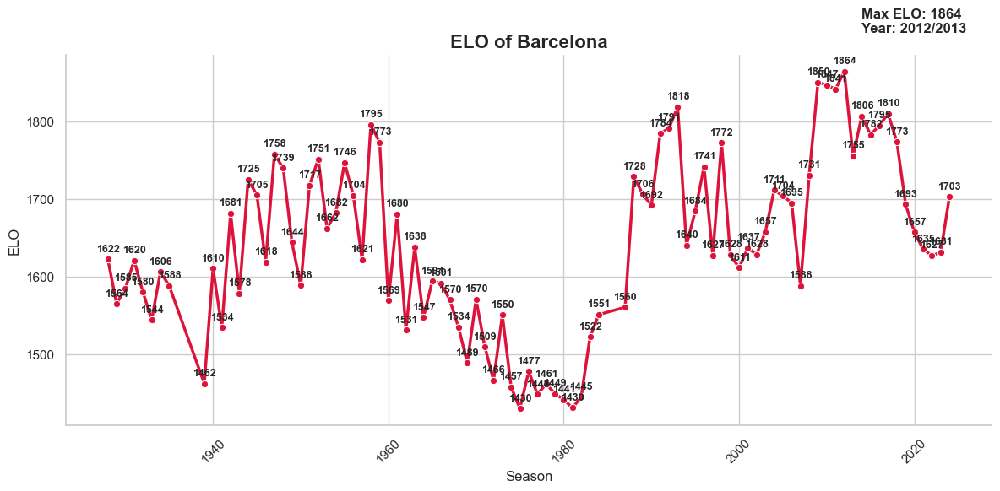
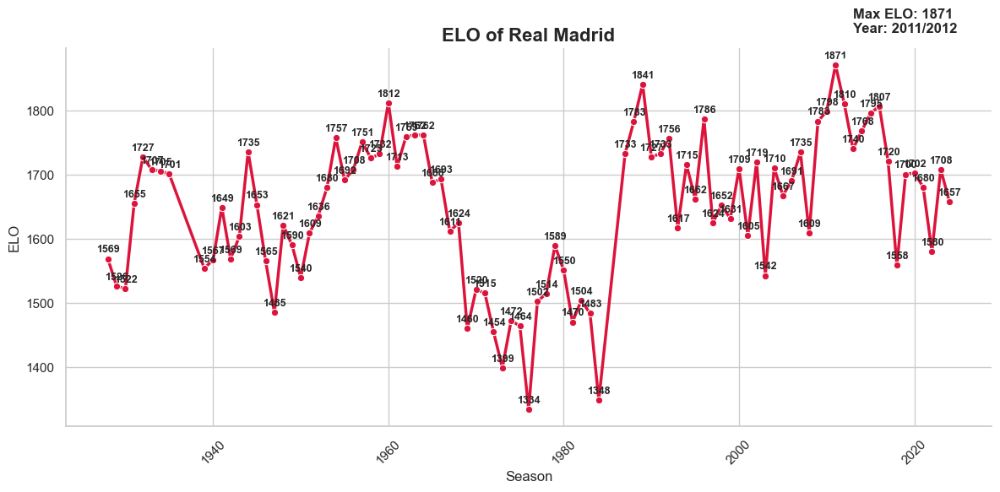

# LaLiga ELO Ratings

A Python project that calculates, tracks, and visualizes Elo ratings for LaLiga teams across seasons. This project allows you to see historical performance trends, rank teams, and analyze competitive dynamics using an Elo-based ranking system similar to those used in competitive games.

## Features

1. **Elo Calculation Engine**  
   Calculates Elo ratings for LaLiga teams from historical match results.

2. **General Elo CSV**  
   Combines the last matchday of each season into a comprehensive dataset.

3. **Visualization**  
   Plots the evolution of each team’s Elo across seasons with annotated maximum points.

4. **Ranking System**  
   Mimics competitive game ranking tiers (Iron → Challenger → Grandmaster) based on Elo scores.

5. **Automated Updates**  
   Scripts to add new season data to the master CSV.

## Project Structure

ELO/ # Elo calculation engine scripts
Graficos/ # Visualization scripts
Ligas_Resultados_CSV/ # Historical match results per season
General_ELO.csv # Combined Elo ratings for all seasons
Calculate_ELO.ipynb # Notebook for calculations
General_ELO_Ratings.ipynb # Notebook for working with master CSV
future_readme # Example first commit file

## Skills & Technologies

- Python: Pandas, NumPy, Matplotlib, Seaborn  
- Data Analysis & Cleaning  
- Elo Rating Systems & Ranking  
- Data Visualization & Trend Analysis  
- Automation & Scripting  
- Git & GitHub  

## Example Visualization

The project can plot the historical Elo of any team by modifying the team name directly in the `matplotlib.ipynb` notebook or `Graficos/` script.

